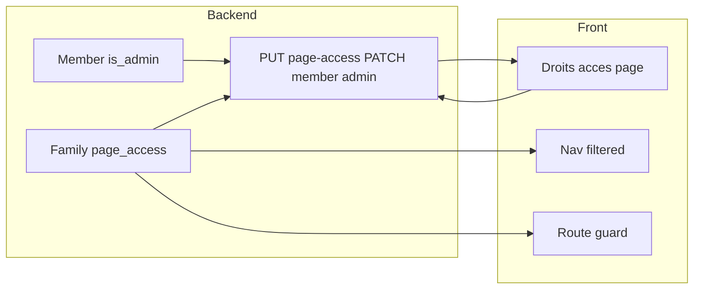

# Gestion des droits d'accès par page (réservée aux admins)

## Contexte

- **Pages concernées** (hors home) : Jeux (`/jeux`), Livres (`/livres/`), Plats (`/plats/`), Tâches (`/taches/`), Listes (`/listes`), Abonnements (`/abonnements/`). Définies dans [@front/app/stores/bottomNav.ts](@front/app/stores/bottomNav.ts) (`ALL_NAV_ITEMS`).
- **Qui peut gérer** : uniquement les membres avec le statut **admin**, ou le **compte utilisateur** (propriétaire de la famille) connecté. Le premier admin pourra être désigné depuis la nouvelle page par le propriétaire.
- **Modèle actuel** : [Member](@back/src/api/member/content-types/member/schema.json) n’a pas de champ admin. [Family](@back/src/api/family/content-types/family/schema.json) n’a pas de champ pour les droits par page. L’API famille est exposée via [@back/src/api/family/controllers/family.js](@back/src/api/family/controllers/family.js) et la route custom `GET /families/me`.

## 1. Backend (Strapi)

### 1.1 Schémas

- **Member** : ajouter un booléen `is_admin` (défaut `false`) dans [@back/src/api/member/content-types/member/schema.json](@back/src/api/member/content-types/member/schema.json).
- **Family** : ajouter un champ JSON `page_access` dans [@back/src/api/family/content-types/family/schema.json](@back/src/api/family/content-types/family/schema.json). Structure proposée : `{ "jeux": [1, 2], "livres": [1, 2, 3], ... }` (clé = id de page, valeur = liste d’IDs de membres autorisés). Si une page est absente ou le tableau est vide, convention « tous les membres ont accès » (rétrocompatibilité).

### 1.2 Endpoints

- **GET /families/me**  
S’assurer que la réponse inclut `members` avec `is_admin` et la famille avec `page_access` (déjà renvoyée si les champs existent dans le schéma).
- **PUT /families/me/page-access** (nouvelle route custom)  
  - Body : `{ "page_access": { "jeux": [1,2], "livres": [1], ... } }`.  
  - Autorisation : utilisateur authentifié propriétaire de la famille (même logique que `update` dans le controller family).  
  - Valider que les IDs dans `page_access` sont bien des membres de la famille.  
  - Fichiers : [@back/src/api/family/routes/custom.js](@back/src/api/family/routes/custom.js) (ajout route), [@back/src/api/family/controllers/family.js](@back/src/api/family/controllers/family.js) (handler `updatePageAccess`).
- **PATCH /members/:id/admin** (ou équivalent, ex. **PUT /members/:id** avec body `{ "is_admin": true }`)  
  - Réservé au **propriétaire de la famille** (vérifier que le membre appartient à la famille de l’utilisateur).  
  - Fichiers : [@back/src/api/member/routes/custom.js](@back/src/api/member/routes/custom.js), [@back/src/api/member/controllers/member.js](@back/src/api/member/controllers/member.js).

Après modification des schémas, régénérer les types si nécessaire (ex. `npm run build` dans `@back`).

## 2. Frontend (Nuxt)

### 2.1 Données et typage

- **Family** : dans [@front/app/stores/family.ts](@front/app/stores/family.ts), étendre l’interface (ex. `Family`) pour inclure `page_access?: Record<string, number[]>` et s’assurer que les membres ont `is_admin?: boolean` (déjà présent si retournés par l’API).
- **Composable ou store** : exposant une méthode du type `updatePageAccess(page_access)` appelant `PUT /families/me/page-access`, et éventuellement `setMemberAdmin(memberId, is_admin)` pour le PATCH membre. Réutiliser le token auth existant.

### 2.2 Page « Gérer les droits d’accès »

- **Route** : ex. `/parametres/droits-acces` (cohérent avec [@front/app/pages/parametres/menu.vue](@front/app/pages/parametres/menu.vue)).
- **Contenu** :
  - Liste des pages (ids hors `home`, alignés sur `ALL_NAV_ITEMS` : jeux, livres, plats, taches, listes, abonnements).
  - Pour chaque page : liste des membres de la famille avec une case à cocher « a accès ». Si `page_access[pageId]` est absent ou vide, considérer « tous ont accès » (ex. toutes les cases cochées par défaut).
  - Section « Administrateurs » (visible uniquement pour le **compte utilisateur** connecté, pas en mode « membre ») : pour chaque membre, case à cocher « Admin » ; sauvegarde via PATCH membre.
- **Accès à la page** :
  - **Utilisateur** (auth Strapi, pas de membre connecté) : toujours autorisé (propriétaire de la famille).
  - **Membre connecté** : autorisé seulement si `family.members.find(m => m.id === currentMember.id)?.is_admin === true`.
  - Sinon : redirection (ex. vers `/`) ou message « Accès réservé aux administrateurs ».

### 2.3 Application des droits

- **Middleware ou layout** : lorsqu’un **membre** est connecté (`memberStore.currentMember`), avant d’accéder à une route « page » (jeux, livres, plats, taches, listes, abonnements), vérifier l’accès :
  - Récupérer `page_access` depuis le store famille (données déjà chargées par `fetchFamily`).
  - Mapping route → pageId (ex. `/jeux` → `jeux`, `/livres/` → `livres`, etc.).
  - Si `page_access[pageId]` existe et est un tableau non vide et que `currentMember.id` n’est pas dans ce tableau → rediriger vers `/` (ou page « Accès refusé »).
- **Navigation** : dans [@front/app/components/BottomTabNavigation.vue](@front/app/components/BottomTabNavigation.vue), [@front/app/layouts/default.vue](@front/app/layouts/default.vue) (menu latéral / hamburger), et tout endroit qui affiche les liens vers jeux, livres, plats, taches, listes, abonnements : n’afficher que les pages auxquelles le membre connecté a accès (si utilisateur connecté sans membre, tout afficher). Réutiliser une liste dérivée de `ALL_NAV_ITEMS` sans `home`, filtrée selon `page_access` et `currentMember.id`.

### 2.4 Entrées de menu

- Ajouter un lien « Gérer les droits d’accès » (ou « Droits d’accès ») dans le menu Paramètres (layout default + drawer « … » du bottom nav), visible uniquement si l’utilisateur peut gérer les droits (utilisateur propriétaire OU membre admin), pointant vers `/parametres/droits-acces`.

## 3. Récapitulatif des fichiers à modifier/créer

| Zone    | Fichier                                   | Action                                                                                            |
| ------- | ----------------------------------------- | ------------------------------------------------------------------------------------------------- |
| Backend | `member/content-types/member/schema.json` | Ajouter `is_admin` (boolean)                                                                      |
| Backend | `family/content-types/family/schema.json` | Ajouter `page_access` (json)                                                                      |
| Backend | `family/controllers/family.js`            | Handler `updatePageAccess` ; s’assurer que `me` renvoie `page_access` et members avec `is_admin`  |
| Backend | `family/routes/custom.js`                 | Route `PUT /families/me/page-access`                                                              |
| Backend | `member/controllers/member.js`            | Handler pour mettre à jour `is_admin` (réservé propriétaire)                                      |
| Backend | `member/routes/custom.js`                 | Route PATCH/PUT pour `is_admin`                                                                   |
| Front   | `stores/family.ts`                        | Types `page_access`, `is_admin` ; action `updatePageAccess` (et optionnellement `setMemberAdmin`) |
| Front   | `pages/parametres/droits-acces.vue`       | **Créer** : page gestion droits + section admins                                                  |
| Front   | Middleware ou layout                      | Vérifier accès membre par page et rediriger si interdit                                           |
| Front   | `BottomTabNavigation.vue`, `default.vue`  | Filtrer les liens selon droits ; ajouter lien « Droits d’accès » (conditionnel)                   |

## 4. Flux résumé

- Le **propriétaire** (compte utilisateur) peut ouvrir la page, définir les admins et les droits par page.
- Les **membres admin** peuvent ouvrir la même page et modifier uniquement les droits par page (pas la liste des admins).
- Les **membres non admin** ne voient pas le lien et sont redirigés s’ils accèdent à l’URL.
- La **navigation** et le **guard** utilisent `page_access` et `currentMember.id` pour n’afficher et n’autoriser que les pages permises.

