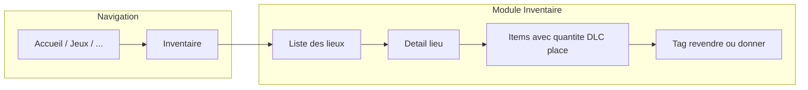

# Plan : Inventaire / rangement + tag revendre ou donner

## Contexte

Ludolist dispose déjà de **List** et **List-item** ([@back/src/api/list](@back/src/api/list), [@back/src/api/list-item](@back/src/api/list-item)) avec droits par liste (`allowed_members`). L’objectif est d’étendre ce modèle pour :

- distinguer une **liste classique** (courses, vacances) d’un **lieu d’inventaire** (cave, armoire, etc.) ;
- ajouter sur les items : quantité, date de péremption, emplacement, et un **tag** « à revendre » ou « à donner » (sans prix ni état).

---

## 1. Backend (Strapi)

### 1.1 Schéma List

**Fichier :** [@back/src/api/list/content-types/list/schema.json](@back/src/api/list/content-types/list/schema.json)

- Ajouter un attribut `**list_type**` :
  - Type : `enumeration`, valeurs `["list", "inventory"]`
  - Défaut : `"list"`
  - Optionnel (pour ne pas casser les listes existantes)

Les listes existantes restent en `list` ; les nouveaux « lieux » seront créés en `inventory`.

### 1.2 Schéma List-item

**Fichier :** [@back/src/api/list-item/content-types/list-item/schema.json](@back/src/api/list-item/content-types/list-item/schema.json)

Ajouter quatre champs optionnels :

| Attribut      | Type          | Description                                                           |
| ------------- | ------------- | --------------------------------------------------------------------- |
| `quantity`    | `integer`     | Nombre (ex. 2 boîtes). Null ou 0 = non renseigné.                     |
| `expiry_date` | `date`        | DLC/DLUO pour consommables.                                           |
| `place`       | `string`      | Emplacement dans le lieu (ex. « Étagère du haut », « Boîte outils »). |
| `disposition` | `enumeration` | Valeurs `["revendre", "donner"]`. Vide = pas de tag.                  |

Tous optionnels pour garder la compatibilité avec les listes classiques.

### 1.3 Controller List

**Fichier :** [@back/src/api/list/controllers/list.js](@back/src/api/list/controllers/list.js)

- **create** : accepter `listType` dans le body (`"list"` ou `"inventory"`). Si absent, garder le comportement actuel (équivalent `"list"`).
- **getByFamily** : pas de changement obligatoire ; le front pourra filtrer côté client sur `list_type`. Optionnel : accepter un query `listType=inventory` et filtrer les listes renvoyées.

### 1.4 Controller List-item

**Fichier :** [@back/src/api/list-item/controllers/list-item.js](@back/src/api/list-item/controllers/list-item.js)

- **addToList** : accepter dans le body `quantity`, `expiry_date`, `place`, `disposition` (optionnels) et les passer au `entityService.create`.
- **update** : au lieu de mettre à jour uniquement `name`, accepter aussi `quantity`, `expiry_date`, `place`, `disposition` (tous optionnels). Garder la mise à jour du nom comme aujourd’hui.

Penser à inclure ces champs dans les `populate` si besoin (les relations existantes suffisent ; les nouveaux champs sont des champs directs de l’entité).

### 1.5 Types générés

Après modification des schémas, regénérer les types Strapi si le projet le fait (ex. `npm run generate:types` dans `@back`). Fichier concerné : [@back/types/generated/contentTypes.d.ts](@back/types/generated/contentTypes.d.ts).

---

## 2. Frontend (Nuxt)

### 2.1 Types et API (useLists)

**Fichier :** [@front/app/composables/useLists.ts](@front/app/composables/useLists.ts)

- **Interface `List**` : ajouter `list_type?: 'list' | 'inventory'` (optionnel pour rétrocompatibilité).
- **Interface `ListItem**` : ajouter `quantity?: number | null`, `expiry_date?: string | null`, `place?: string | null`, `disposition?: 'revendre' | 'donner' | null`.
- **createList** : ajouter un paramètre optionnel `listType?: 'list' | 'inventory'` et l’envoyer dans le body.
- **addItem** : ajouter paramètres optionnels `quantity`, `expiry_date`, `place`, `disposition` et les envoyer au backend.
- **updateListItem** : remplacer l’appel actuel (nom seul) par un objet optionnel `{ name?, quantity?, expiry_date?, place?, disposition? }` pour permettre la mise à jour de tous ces champs (au moins pour les champs inventaire + disposition).

### 2.2 Page Inventaire (liste des lieux)

- **Route :** `/inventaire` (nouvelle page).
- **Comportement :** réutiliser `useLists().fetchLists()` puis filtrer côté client les listes avec `list_type === 'inventory'`. Afficher ces listes comme des « lieux » (même présentation que [@front/app/pages/listes/index.vue](@front/app/pages/listes/index.vue) mais uniquement pour l’inventaire).
- **Création d’un lieu :** ouvrir un modal ou drawer « Nouveau lieu » qui appelle `createList(nom, allowedMemberIds, 'inventory')`. Les champs `allowed_members` peuvent être les mêmes que pour une liste (partage famille ou membres choisis).

### 2.3 Détail d’un lieu (liste d’items d’un lieu)

Deux options (à trancher en implémentation) :

- **Option A :** réutiliser [@front/app/pages/listes/[documentId].vue](@front/app/pages/listes/[documentId].vue). Si `list.list_type === 'inventory'`, afficher la vue « inventaire » (champs quantité, péremption, place, disposition) et adapter les composants enfants (ListItemCard, AddListItemModal) selon un prop ou le contexte (ex. `isInventory`).
- **Option B :** créer une page dédiée `/inventaire/[documentId].vue` qui charge la liste par documentId, vérifie `list_type === 'inventory'` et redirige vers `/listes/[documentId]` si c’est une liste classique, sinon affiche la même structure que la page liste mais avec les champs inventaire + disposition.

Recommandation : **Option A** pour éviter la duplication de logique (droits, chargement, suppression, etc.).

### 2.4 Composant ListItemCard

**Fichier :** [@front/app/components/listes/ListItemCard.vue](@front/app/components/listes/ListItemCard.vue)

- Ajouter une **prop** `isInventory?: boolean` (ou déduire du type de liste si la liste est passée en prop).
- Quand `isInventory` est vrai :
  - Afficher sous le nom : quantité (si renseignée), date de péremption (avec style « bientôt périmé » si souhaité), emplacement (`place`).
  - Afficher un **badge** pour la disposition : « À revendre » ou « À donner » (couleur distincte), et un moyen de modifier ou retirer le tag (bouton ou menu).
- En édition : permettre de modifier, en plus du nom, quantité, date de péremption, place et disposition (select ou boutons revendre / donner / aucun). Les mises à jour passeront par `updateListItem` avec l’objet étendu.

### 2.5 Composant AddListItemModal

**Fichier :** [@front/app/components/listes/AddListItemModal.vue](@front/app/components/listes/AddListItemModal.vue)

- Ajouter une prop `isInventory?: boolean`.
- Quand `isInventory` est vrai : afficher des champs optionnels **Quantité**, **Date de péremption**, **Emplacement**, **Disposition** (aucun / à revendre / à donner). Lors de l’ajout, appeler `addItem(..., quantity, expiry_date, place, disposition)` avec les valeurs saisies.

### 2.6 Navigation et droits

- **Bottom nav :** dans [@front/app/stores/bottomNav.ts](@front/app/stores/bottomNav.ts), ajouter un item dans `ALL_NAV_ITEMS` : `{ id: 'inventaire', label: 'Inventaire', icon: 'i-ion-cube', to: '/inventaire' }`.
- **Middleware auth :** dans [@front/app/middleware/auth.ts](@front/app/middleware/auth.ts), ajouter dans `PAGE_PATH_PREFIXES` une entrée `{ prefix: '/inventaire', pageId: 'inventaire' }` pour que les droits par page s’appliquent (comme pour `listes`).
- **Droits par page :** le mécanisme dans [@front/app/composables/usePageAccess.ts](@front/app/composables/usePageAccess.ts) filtre déjà les onglets via `page_access[item.id]`. Il faudra que le schéma Family / l’admin Strapi permette de configurer `page_access.inventaire` (liste d’IDs membres ou vide = tout le monde), comme pour les autres pages. Aucun changement de code obligatoire dans `usePageAccess` si `inventaire` est simplement un nouvel id dans `ALL_NAV_ITEMS`.

### 2.7 Layout et redirections

- Dans [@front/app/layouts/default.vue](@front/app/layouts/default.vue), si une logique de « retour » existe pour les listes (ex. bouton retour vers `/listes`), étendre pour les routes `/inventaire` et `/inventaire/:id` afin que le retour mène vers `/inventaire` quand on est dans le contexte inventaire.

---

## 3. Flux utilisateur résumé

1. L’utilisateur ouvre **Inventaire** dans la nav.
2. Il voit les **lieux** (listes de type `inventory`). Il peut en créer un (ex. « Cave », « Armoire pharmacie »).
3. En ouvrant un lieu, il voit les **items** avec quantité, date de péremption, emplacement, et éventuellement le tag **À revendre** ou **À donner**.
4. Il peut ajouter un item avec ces infos ou taguer un objet existant « à revendre » ou « à donner » (sans prix ni état).

---

## 4. Récapitulatif des fichiers à modifier

| Zone     | Fichiers                                                                                                                                                                                                                                                                                                                                                                                                                                                                                                 |
| -------- | -------------------------------------------------------------------------------------------------------------------------------------------------------------------------------------------------------------------------------------------------------------------------------------------------------------------------------------------------------------------------------------------------------------------------------------------------------------------------------------------------------- |
| Backend  | [@back/src/api/list/content-types/list/schema.json](@back/src/api/list/content-types/list/schema.json), [@back/src/api/list-item/content-types/list-item/schema.json](@back/src/api/list-item/content-types/list-item/schema.json), [@back/src/api/list/controllers/list.js](@back/src/api/list/controllers/list.js), [@back/src/api/list-item/controllers/list-item.js](@back/src/api/list-item/controllers/list-item.js)                                                                               |
| Front    | [@front/app/composables/useLists.ts](@front/app/composables/useLists.ts), [@front/app/pages/listes/[documentId].vue](@front/app/pages/listes/[documentId].vue), [@front/app/components/listes/ListItemCard.vue](@front/app/components/listes/ListItemCard.vue), [@front/app/components/listes/AddListItemModal.vue](@front/app/components/listes/AddListItemModal.vue), [@front/app/stores/bottomNav.ts](@front/app/stores/bottomNav.ts), [@front/app/middleware/auth.ts](@front/app/middleware/auth.ts) |
| Nouveaux | Page [@front/app/pages/inventaire/index.vue](@front/app/pages/inventaire/index.vue) (liste des lieux) ; optionnel [@front/app/pages/inventaire/[documentId].vue](@front/app/pages/inventaire/[documentId].vue) si on ne réutilise pas la page listes pour le détail.                                                                                                                                                                                                                                     |
| Layout   | [@front/app/layouts/default.vue](@front/app/layouts/default.vue) (retour depuis détail inventaire vers `/inventaire`)                                                                                                                                                                                                                                                                                                                                                                                    |

---

## 5. Points d’attention

- **Migration des données :** les listes et list-items existants n’ont pas les nouveaux champs ; les valeurs seront `null` / `undefined`. Le front doit gérer l’absence de `list_type` (traiter comme `"list"`) et l’absence des champs item (ne rien afficher pour quantité, DLC, place, disposition).
- **Disposition sur listes classiques :** on peut autoriser le tag « revendre » / « donner » sur n’importe quel item (y compris listes courses) pour plus de souplesse ; l’UI peut n’afficher les champs inventaire + disposition que lorsque la liste est de type `inventory` pour garder l’UX simple.
- **Péremption :** affichage optionnel (ex. badge orange si `expiry_date` dans les 7 jours) et tri par date dans un lieu peuvent être ajoutés dans un second temps.

