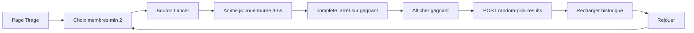
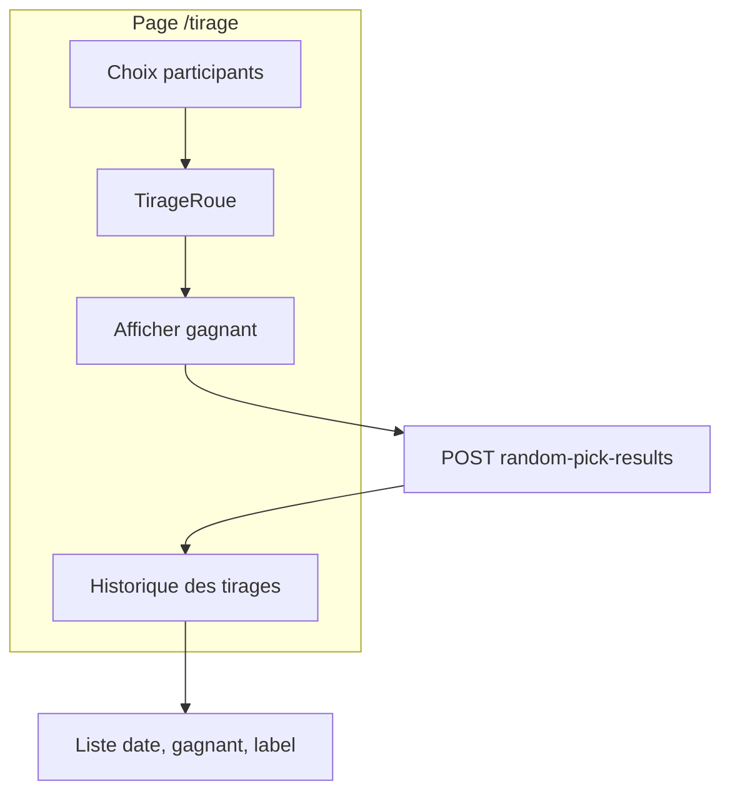

# Tirage au sort parmi les membres

## Contexte

- **documentId** : partout dans le projet on utilise le **documentId** (Strapi 5) comme identifiant stable pour les entités. Les APIs, relations et payloads (création, listes) doivent s’appuyer sur `documentId` plutôt que sur l’`id` numérique.
- **Backend et base de données** : noms en **anglais** (content-types, noms de collection, champs, routes API, dossiers et fichiers du back). L’UI utilisateur (front, libellés) reste en français.
- **Membres** : fournis par le store famille via `familyMembers` ([@front/app/stores/family.ts](@front/app/stores/family.ts)) — getter existant, pas d’API supplémentaire.
- **Navigation** : nouvelle entrée dans [@front/app/stores/bottomNav.ts](@front/app/stores/bottomNav.ts) (`ALL_NAV_ITEMS`), puis préfixe dans [@front/app/middleware/auth.ts](@front/app/middleware/auth.ts) pour les droits d’accès. La page "Droits d'accès" utilisera automatiquement le nouvel item (elle boucle sur `ALL_NAV_ITEMS` hors "home").
- **Animation** : [Anime.js](https://animejs.com/) — bibliothèque légère, API intuitive, easings intégrés et callbacks (idéal pour la rotation de la roue et la synchro avec l’affichage du résultat).

## 1. Dépendance Anime.js

- **Installation** : `pnpm add animejs` dans `@front/` (le site officiel indique `npm i animejs`).
- **Usage** : importer dans le composant roue (ex. `import anime from 'animejs'`). Utiliser Anime.js uniquement pour la roue (pas besoin d’importer tout le bundle ; l’API modulaire permet de garder le poids maîtrisé si besoin).

## 2. Intégration dans la navigation et les droits

- **bottomNav** : ajouter un `NavItem` (ex. `id: 'tirage'`, label « Tirage au sort », icon `i-ion-shuffle` ou `i-ion-dice`, `to: '/tirage'`). Ne pas l’ajouter dans `DEFAULT_MAIN_IDS` ; il apparaîtra dans le menu « … » et pourra être promu via « Réorganiser le menu ».
- **auth middleware** : ajouter `{ prefix: '/tirage', pageId: 'tirage' }` dans `PAGE_PATH_PREFIXES`.

## 3. Page `/tirage`

- **Fichier** : `@front/app/pages/tirage/index.vue` (ou `tirage.vue` à la racine de `pages`).
- **Layout** : `default`, middleware `auth`.
- **Contenu** :
  - **Sélection des participants** : liste des `familyMembers` avec cases à cocher (ou switches). Au moins **2** membres doivent être sélectionnés pour activer le bouton « Lancer le tirage ». Afficher les noms (et optionnellement `MemberAvatar`).
  - **Bouton** : « Lancer le tirage » (désactivé si &lt; 2 sélectionnés).
  - **Zone d’affichage ludique** : après clic, afficher la **roue** animée avec Anime.js, avec **délai + animation** avant le résultat.

## 4. Affichage ludique : roue avec Anime.js

- **Principe** : roue circulaire (SVG ou div avec segments) avec autant de segments que de participants. Chaque segment = un membre (nom ou initiale, couleurs type [MemberAvatar](@front/app/components/MemberAvatar.vue)).
- **Algorithme** :
  - Tirer le gagnant côté client : `const winnerIndex = Math.floor(Math.random() * selectedMembers.length)`.
  - Calculer l’angle de rotation finale pour que le segment gagnant soit sous l’indicateur : ex. `rotation = 360 * (5 à 8 tours) + angle_du_segment_gagnant`.
- **Animation avec Anime.js** :
  - Cibler l’élément de la roue (ex. `targets: '.roue-container'` ou ref Vue).
  - Propriété à animer : `rotate` (degré ou radian selon l’API Anime.js ; en général `rotate: '+=XXXdeg'` ou valeur absolue).
  - **Durée** : 3 à 5 secondes.
  - **Easing** : utiliser un easing intégré type `easeOutExpo` ou `easeOutCubic` pour ralentir en fin de course (effet « roue qui s’arrête »).
  - **Callback** `complete` : à la fin de l’animation, émettre le gagnant (`@result` ou `emit('result', winner)`) et afficher le résultat (message + optionnel confetti / highlight).
- **Délai / mise en scène** : soit la roue démarre au clic et s’arrête après 3–5 s, soit court compte à rebours (3, 2, 1) puis démarrage ; recommandation : démarrage direct avec Anime.js pour garder une seule timeline claire.
- **Après l’arrêt** : afficher le gagnant (nom + avatar), bouton « Rejouer » pour relancer.

## 5. Stockage des résultats et historique

- **Backend (Strapi)** : nouveau type de contenu **RandomPickResult** (noms en anglais) — collection `random_pick_results`, singularName `random-pick-result`, pluralName `random-pick-results` — pour persister chaque tirage et partager l’historique au niveau famille.
  - **Champs (anglais)** : `family` (relation manyToOne → family), `winner` (relation manyToOne → member), `drawn_at` (datetime), optionnel `label` (string), optionnel `participant_document_ids` (JSON, liste de **documentId** des participants).
  - **Convention documentId** : en base les relations utilisent les documentId ; les routes et le controller résolvent / filtrent par `documentId` (comme ailleurs dans le projet, ex. [@back/src/api/task/controllers/task.js](@back/src/api/task/controllers/task.js), [@back/src/api/family/controllers/family.js](@back/src/api/family/controllers/family.js)).
  - **Routes personnalisées (anglais)** : 
    - `POST /api/random-pick-results` (ou `/api/random-pick-results/create`) : body avec **winnerDocumentId**, famille dérivée du token (via documentId), optionnel **label**, optionnel **participantDocumentIds** (tableau de documentId). Vérifier que la famille et le membre gagnant appartiennent à l’utilisateur connecté (recherche par documentId).
    - `GET /api/random-pick-results` (ou `/api/random-pick-results/family`) : lister les résultats de la famille de l’utilisateur, triés par `drawn_at` décroissant (ex. 50 derniers). Réponse avec `winner` (incluant `documentId`) et optionnellement `family` peuplés ; exposer `documentId` pour chaque RandomPickResult et pour les entités liées.
  - **Dossier back** : `@back/src/api/random-pick-result/` (controller, service, routes, content-types avec noms anglais).
  - **Policies / permissions** : restreindre création et lecture aux utilisateurs authentifiés dont la famille correspond.
- **Frontend** :
  - **Après chaque tirage** : à l’émission du gagnant par `TirageRoue`, appeler l’API **POST /api/random-pick-results** en envoyant **winnerDocumentId** (et **participantDocumentIds** si stockés), optionnel label, puis rafraîchir l’historique. S’assurer que les membres exposent `documentId` (étendre l’interface `Member` dans [@front/app/stores/family.ts](@front/app/stores/family.ts) si l’API `/families/me` le renvoie déjà, sinon adapter le chargement famille pour l’inclure).
  - **Affichage historique** : sur la page `/tirage`, une section « Historique des tirages » qui affiche la liste des résultats (date/heure, gagnant, label). Le front appelle **GET /api/random-pick-results** (ou équivalent list by family). Les entités renvoyées utilisent `documentId`.
- **Optionnel** : champ « Contexte » ou « Motif » (label) saisissable avant de lancer le tirage.

## 6. Structure technique recommandée

- **Composant Roue** : [@front/app/components/TirageRoue.vue](@front/app/components/TirageRoue.vue) — reçoit la liste des membres sélectionnés, utilise **Anime.js** pour animer la rotation, émet `@result` avec le membre gagnant dans le callback `complete`. La page gère l’état « en cours » / « résultat », enregistrement du résultat en API puis affichage de l’historique.
- **Accessibilité** : ne pas bloquer le focus pendant l’animation ; annoncer le résultat (texte visible, `aria-live` si pertinent).

## 7. Récapitulatif des fichiers à créer/modifier

| Fichier | Action |
|--------|--------|
| [@front/package.json](@front/package.json) | Ajouter la dépendance `animejs` |
| [@front/app/stores/bottomNav.ts](@front/app/stores/bottomNav.ts) | Ajouter l’entrée « Tirage au sort » dans `ALL_NAV_ITEMS` |
| [@front/app/middleware/auth.ts](@front/app/middleware/auth.ts) | Ajouter le préfixe `/tirage` avec `pageId: 'tirage'` |
| `@front/app/pages/tirage/index.vue` | Nouvelle page : sélection membres (min 2), bouton, TirageRoue, affichage du résultat, **section Historique** (liste des tirages) + appel API sauvegarde / chargement historique |
| `@front/app/components/TirageRoue.vue` | Nouveau composant : roue SVG/HTML, **animation rotation avec Anime.js** (duration, easing, complete), émission du gagnant |
| `@back/src/api/random-pick-result/` | Nouveau module Strapi : content-type **RandomPickResult** (collection `random_pick_results`), champs et routes en **anglais** (family, winner, drawn_at, label?, participant_document_ids? ; POST/GET `/api/random-pick-results`). **documentId** pour relations et payloads. |

## 8. Schéma du flux

